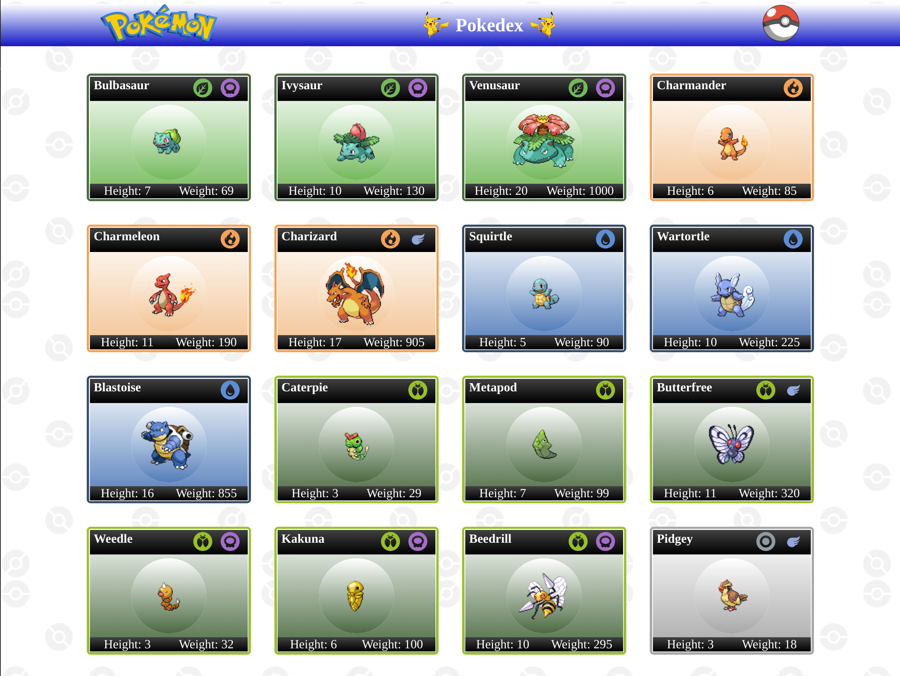

# SDD Chanllenge



> Linha adicional de texto informativo sobre o que o projeto faz. Sua introdução deve ter cerca de 2 ou 3 linhas. Não exagere, as pessoas não vão ler.

### Ajustes e melhorias

O projeto ainda está em desenvolvimento e as próximas atualizações serão voltadas nas seguintes tarefas:

- [x] Renderizar corretamente evoluções para pokemons com mais de uma árvore evolutiva.
- [x] Página de detalhes e card de pokemons feitas mobile first.
- [x] Paginação por rolagem infinita.
- [ ] Adcionar mais detalhes a página de detalhes.
- [ ] Implementar a utilização da library Chakra UI


## 💻 Pré-requisitos

Antes de começar, verifique se você atendeu aos seguintes requisitos:

* Verifique se o Yarn ou NPM está instalado e na versão mais recente executando o comando`yarn --version` ou `npm --version`.


## 🚀 Instalando SDD Challenge

Para instalar o SDD Challenge, siga estas etapas:

Linux e macOS:
```
yarn install
```
ou
```
npm install
```

## ☕ Usando SDD Challenge

Para usar SDD Challenge, siga estas etapas:

Execute o comando 
```
yarn start
```
ou
```
npm start
```

[⬆ Voltar ao topo](#nome-do-projeto)<br>